# Диаграммы InterviewHub — Магистерская диссертация

Исходники: `.mmd` (Mermaid) | Рендер: `svg/` (SVG для Word/LaTeX)

## UML-диаграммы

| Файл | Тип | Описание |
|------|-----|----------|
| [01_use_case.mmd](01_use_case.mmd) / [svg](svg/01_use_case.svg) | Use Case | Роли (user, admin, система) и варианты использования |
| [02_seq_video_pipeline.mmd](02_seq_video_pipeline.mmd) / [svg](svg/02_seq_video_pipeline.svg) | Sequence | Полный пайплайн обработки видео (POST → download → transcribe → extract → save) |
| [03_seq_authentication.mmd](03_seq_authentication.mmd) / [svg](svg/03_seq_authentication.svg) | Sequence | Регистрация, вход, JWT-авторизация, проверка роли |
| [04_seq_websocket.mmd](04_seq_websocket.mmd) / [svg](svg/04_seq_websocket.svg) | Sequence | WebSocket соединение и уведомления о прогрессе задачи |
| [05_seq_mock_interview.mmd](05_seq_mock_interview.mmd) / [svg](svg/05_seq_mock_interview.svg) | Sequence | Mock-собеседование с AI chatbot (сессии, LLM, fallback) |
| [06_class_services.mmd](06_class_services.mmd) / [svg](svg/06_class_services.svg) | Class | Классы сервисного слоя: VideoDownloader, WhisperOrchestrator, TaskRuntime и др. |
| [07_class_api.mmd](07_class_api.mmd) / [svg](svg/07_class_api.svg) | Class | API-слой: роутеры, Pydantic-модели, DepsModule |
| [08_class_general.mmd](08_class_general.mmd) / [svg](svg/08_class_general.svg) | Class | **Общая диаграмма классов** — все основные классы и их связи |
| [09_state_task.mmd](09_state_task.mmd) / [svg](svg/09_state_task.svg) | State Machine | Автомат состояний задачи обработки: pending → completed / error |

## Архитектурные схемы

| Файл | Тип | Описание |
|------|-----|----------|
| [11_component.mmd](11_component.mmd) / [svg](svg/11_component.svg) | Component | Компонентная архитектура: браузер, backend, Whisper, DB, внешние API |
| [12_deployment.mmd](12_deployment.mmd) / [svg](svg/12_deployment.svg) | Deployment | Docker Compose: контейнеры, порты, volumes, сети |
| [13_module_deps.mmd](13_module_deps.mmd) / [svg](svg/13_module_deps.svg) | Dependencies | Граф зависимостей Python-модулей backend |

## Схемы данных

| Файл | Тип | Описание |
|------|-----|----------|
| [14_er_diagram.mmd](14_er_diagram.mmd) / [svg](svg/14_er_diagram.svg) | ER Diagram | Полная схема БД: 20 таблиц, все связи и ключи |

## Алгоритмические схемы

| Файл | Тип | Описание |
|------|-----|----------|
| [10_activity_llm_fallback.mmd](10_activity_llm_fallback.mmd) / [svg](svg/10_activity_llm_fallback.svg) | Flowchart | Цепочка LLM-провайдеров: OpenRouter → Gemini → Groq → fallback |
| [15_flowchart_ahs.mmd](15_flowchart_ahs.mmd) / [svg](svg/15_flowchart_ahs.svg) | Flowchart | Алгоритм AHS (гибридный поиск): FAISS + лексика + токены + мета |
| [16_flowchart_video_download.mmd](16_flowchart_video_download.mmd) / [svg](svg/16_flowchart_video_download.svg) | Flowchart | Алгоритм загрузки видео: платформа, стратегии форматов, субтитры |

## Preview

### 01 — Use Case: варианты использования


---

### 02 — Sequence: пайплайн обработки видео

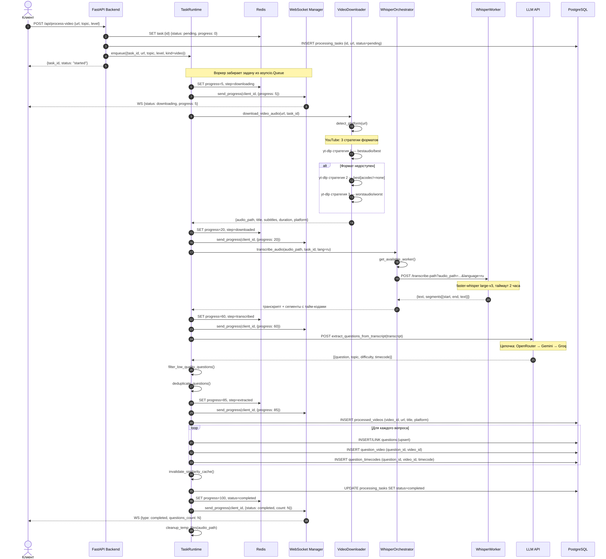

---

### 03 — Sequence: аутентификация

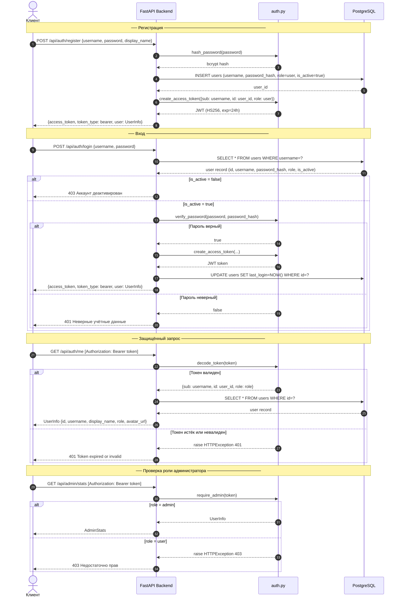

---

### 04 — Sequence: WebSocket прогресс

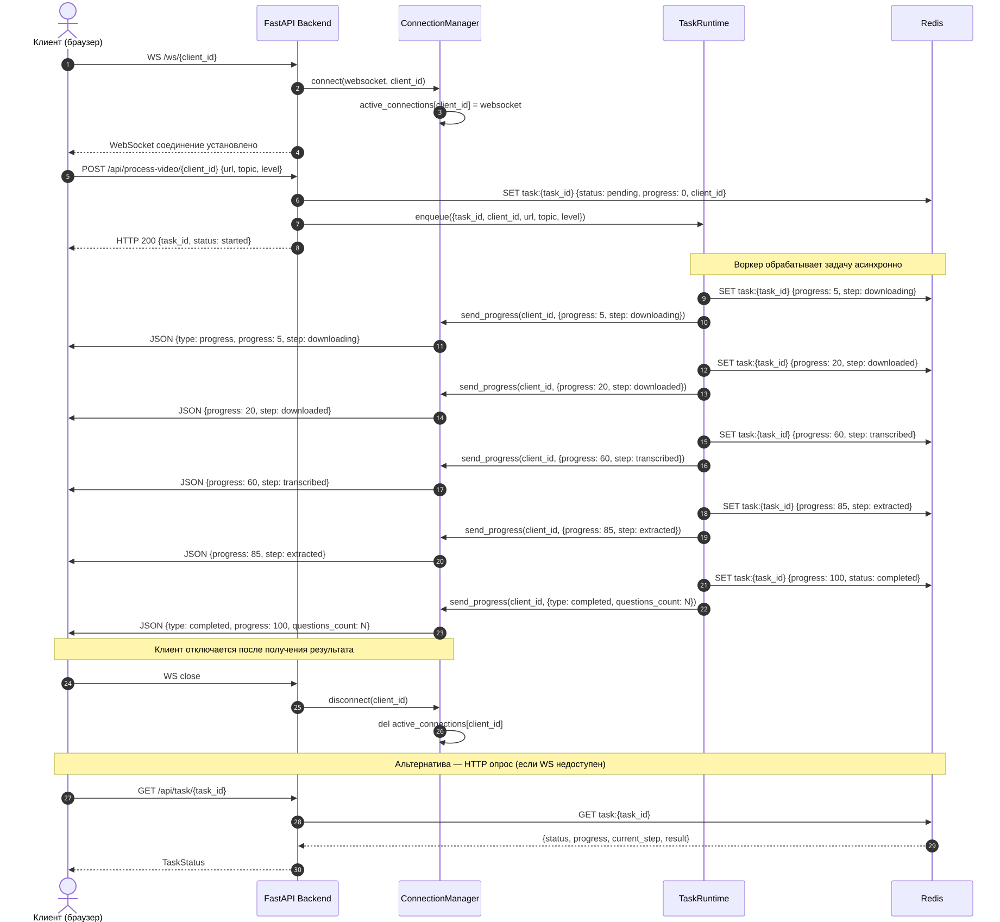

---

### 05 — Sequence: Mock-собеседование

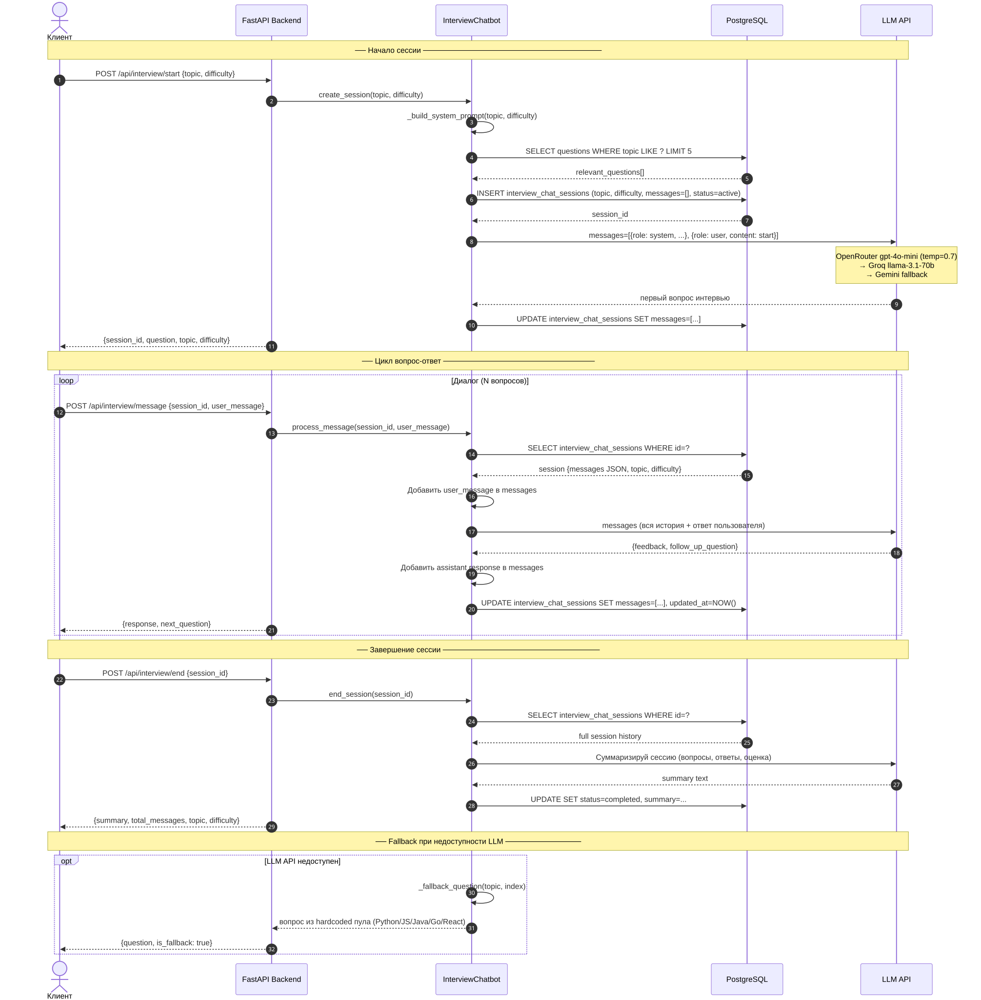

---

### 06 — Class: сервисный слой


---

### 07 — Class: API-слой


---

### 08 — Class: общая диаграмма классов


---

### 09 — State Machine: состояния задачи


---

### 10 — Flowchart: LLM fallback цепочка


---

### 11 — Component: архитектура системы


---

### 12 — Deployment: Docker Compose


---

### 13 — Module Dependencies: зависимости модулей


---

### 14 — ER Diagram: схема базы данных


---

### 15 — Flowchart: алгоритм AHS (гибридный поиск)


---

### 16 — Flowchart: загрузка видео


---

## Регенерация SVG

```bash
# Один файл
npx @mermaid-js/mermaid-cli -i diagrams/01_use_case.mmd -o diagrams/svg/01_use_case.svg --backgroundColor transparent

# Все файлы
for f in diagrams/*.mmd; do
  name=$(basename "$f" .mmd)
  npx @mermaid-js/mermaid-cli -i "$f" -o "diagrams/svg/${name}.svg" --backgroundColor transparent
done
```
